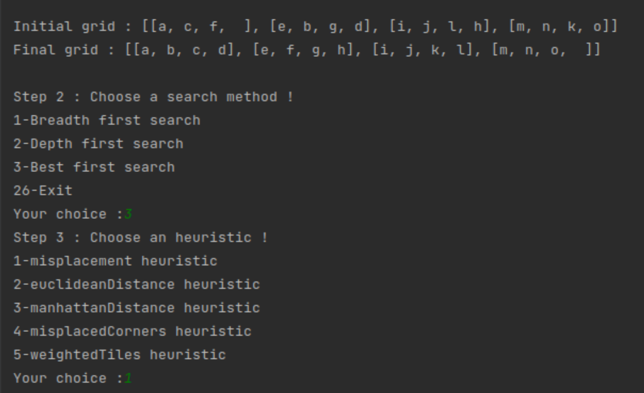
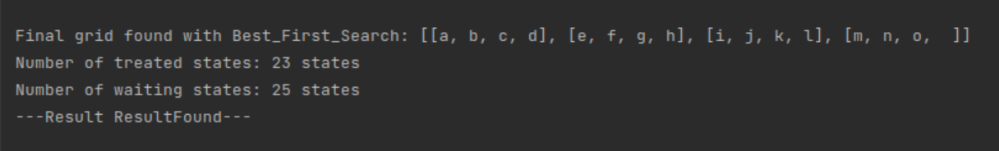

<h1 align="center" > Taquin </h1>
<h3 align = "center" >College IA Projet</h3> 

  </img>
  </img>

<h2 align="center">Programming language :</h2>

<h2 align="center">Operating system :</h2>

<h2 align="center">Tool :</h2>

